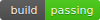

# Software Engineering FS2020 Template Repository




## About

Template repository to start implementing each project required in ETHZ Software Engineering Course in FS2020. The template repository was implemented in Ubuntu Linux 18.04 (LTS) OS using zsh and C++11 any additional dependencies are listed in the [depedencies](./.depedencies.txt) file. Howevwer, the OS is not a depedency, the software can be programmed the same way in any other platforms/OS.

Recomended text editor is the [VS code](https://code.visualstudio.com/) or an IDE like [CLion](https://www.jetbrains.com/clion/download/#section=linux). However, there is no restriction since there is a cmake based project it should/must work wherever.

## Usage
Each member of the team should install git. If you don't know how see [this](https://git-scm.com/book/en/v2/Getting-Started-Installing-Git).

The leader's tasks:
The leader of the team clones this project and resets git. Open a command line terminal and type:

```bash
git clone https://gitlab.ethz.ch/dinfk-lecturers/softwareengineeringfs2020templaterepository.git
cd softwareengineeringfs2020templaterepository
rm -r .git
```

The leader of the team creates a new project in gitlab. When creating a new repository there is a description of how to add an existing project into this repository. Follow this guide, the commands would be like:

```
cd <Your Repository Name>
git init
git remote add origing "<gitlab.ethz link of your repository>"
git add .
git commit -m "Initial commit"
git push -u origin master
```

Then on the settings tab choose the members tab. There include your team members with their ETH emails as maintaners. Every member should clone this repository:

```bash
git clone "<gitlab.ethz link of your repository>"
```
For any developer of the team(even the leader) it has to be a seperate branch. To create it type:

```bash
git checkout -b <Your ETH name>
# Now changes are commited to this branch
git add .
git commmit -m "<Your message>"
git push -u origin <Your ETH name>
```

At some point you will need to merge, in order to have one common solution/program. This is typically done when the team meets, to decide all together how to merge. If there are no confilcts (two members writting to the same file) the leader can do it to the master branch.

```bash
# merge MyBranch to master (supposing I work at MyBranch and I have pushed all the changes)
git checkout master
git merge MyBranch
```

If there is a conflict:

```bash
git status # What went bad
```

Git adds standard conflict-resolution markers to the files that have conflicts, so you can open them manually and resolve those conflicts and then try merging again.

Use the code below to change branches. However, before doing so, take care that all the changes are pushed.
```bash
git chechkout -b <The other branch>
```

For more about branching and mergine use this [link](https://git-scm.com/book/en/v2/Git-Branching-Basic-Branching-and-Merging).

For more about git commands and if you want to sharpen your knowledge please visit:
[https://git-scm.com/doc](https://git-scm.com/doc)

### Install depdencies

For **Unix** based: launch this [script](./tools/install_depedencies.sh).
For **Windows** install the depedencies in the file [.depencies.txt](.dependencies.txt) manually and install repository submodules with this git command:

```bash
git submodule update --init --recursive
```

### Build

For **Unix** based: launch this [script](./tools/make_all.sh). Then you can navigate to the build folder and just use Make each time there is a change in the source files.
For **Windows** install the depedencies in the file [.depencies.txt](.dependencies.txt) manually. create build folder and launch cmake from this folder.

Manual commands are:

```bash
cd build
cmake ..
make all
```

### Debugging

For debugging use:

```bash
cd build;
cmake -DCMAKE_BUILD_TYPE=Debug ..;
make;
```

### Testing

After building run 1 or 2:

```bash
# 1:
make run_all_tests;
# 2:
make test; # This does not test if the project has been built.
```


##  How to contribute

The contribution guidelines can be found in this [file](./CONTRIBUTING.md). Please read it before pushing any code part.


## License

MIT: read the actual [document] (./LICENSE) and add your name to it, so if anybody else uses your work, it can be traced back to you.


## How to use gitlab

Use this link [https://docs.gitlab.com/ee/gitlab-basics/](https://docs.gitlab.com/ee/gitlab-basics/).


## How to use badges:

https://github.com/dwyl/repo-badges

## OUR INSTRUCTION TO USE THE CODE

First of all, you need 2 consoles open on your pc.
One console is for the healthmonitordevice which sends json files, while the other (our implementation) takes them.
If you want to add json files do it inside: /healthmonitordevices/src/assets/
Also unfortunately we couldn't get Images fetch from jsonxx properly (so please ignore Device Images).
We recommend to change into DEBUG mode in "common.hh" to see if all the FREQ & NFREQ are working as wanted.

Also change the times 'X' inside the "hospital.cpp" foo.isAlarm(X) (X is in seconds)
Such that time X doesn't take too long for you :-) (recommended X=6)
Because some of the X's will take up to 24h

## How to build:

mkdir build
cd build
cmake ..
make

## How to run 

(first console)
cd /healthmonitordevices/src && python3 main.py ../assets/ex.json
(second console)
./src/main/MAIN


